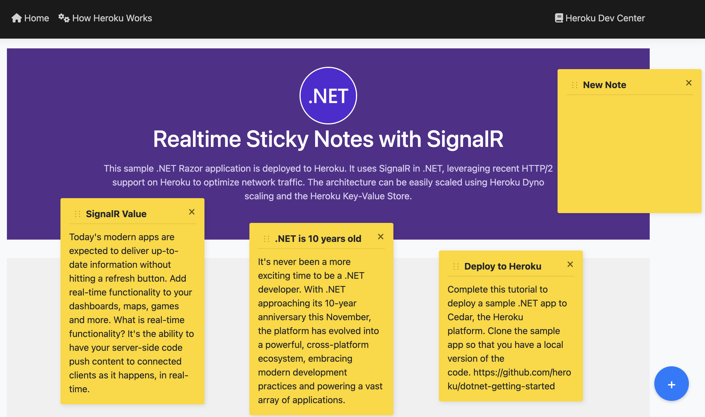

# Realtime Sticky Notes with SignalR and Heroku

This is a real-time, multi-user sticky notes application built with [SignalR](https://dotnet.microsoft.com/en-us/apps/aspnet/signalr) and deployed on Heroku. SignalR enables seamless, bidirectional communication between clients and the server, making it perfect for collaborative experiences. To support horizontal scaling, the app leverages Redis via the [Heroku Key-Value Store](https://devcenter.heroku.com/articles/heroku-redis) add-on, alongside [Heroku Postgres](https://www.heroku.com/postgres) for persistent data storage. 

This app lets users create, edit, and move sticky notes collaboratively in real time across multiple browsers. Whether you're building collaborative tools or experimenting with SignalR and Heroku, this app serves as a fun and practical example of real-time web development in the .NET ecosystem.



## Local

You can run this application locallly without Postgres and Redis configured and it will use an in-memory service for SignalR and SQLite for storage. 

```
cd NotepadApp
dotnet run
```

If you want to attach Heroku Postgres and Heroku Key-Value Store and use them locally during develpment, export the Heroku app's config vars to a `.env` file after creating the app and [provisioning the add-ons](#provision-add-ons):

```
heroku config --shell > .env
```

## Deploy

You can deploy this applicaiton without Postgres and Redis configured and it will use an in-memory service for SignalR and SQLite for storage. Click the Deploy to Heroku button or follow the commands below. 

[](https://www.heroku.com/deploy)

Use the following commands to deploy from the command line:

```
heroku create
git push heroku main
```

The application should be functional at this point. Visit it at the URL shown in the deploy log to confirm.

As a shortcut, you can also open the website using the CLI:

```
heroku open
```

### Provision add-ons

If you want to use Heroku Postgres and Heroku Key-Value Store, run the following commands:

```
heroku addons:create heroku-postgresql:essential-0 --wait
heroku addons:create heroku-redis:mini --wait
```

Your app will automatically be redeployed and configured to use add-ons when provisioned.

### Scale 

To scale horizontally and persist notes across deployments, you must attach Heroku Postgres and Heroku Key-Value Store [as described above](#provision-add-ons).

SignalR requires ["sticky sessions"](https://learn.microsoft.com/en-us/aspnet/core/signalr/scale?view=aspnetcore-9.0#sticky-sessions) when running on multiple servers, so make sure to also enable the [Session Affinity](https://devcenter.heroku.com/articles/session-affinity#enable-session-affinity) feature when scaling horizontally:

```
heroku features:enable http-session-affinity
```
